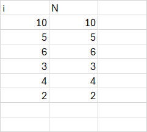

# Loops and Strings - Java Lab 6

**Instructions:**
1. Fork this repository to your GitHub account.
2. Clone the forked repository locally to your machine.
3. Create a new branch named Feature01.

## Part 1: Loop Execution Analysis

**Objective:**
Analyze the execution of the loop in the Java program [LoopExecAnalysis.java](src/LoopExecAnalysis.java).

1. Create a table showing the values of variables i and n during the execution of the loop and add it as markdown below this question, or as an image in this project.
2. 
3. Determine the output of the program and state it below.
4. "10
   5
   6
   3
   4
   2"
3. Discuss if you can prove that this loop terminates for any positive value of n below this question.
4. "I can prove that this loop terminates with a value of 1 for n. I am sure that any value lower will also terminate, 
5. because the code basically just grabs a number and performs a couple of basic math operations"
## Part 2: Square Root Approximation

**Objective:**
Write a method to approximate the square root of a given number.

1. Create a Java file named `src/MySqRoot.java` and implement a method named `squareRoot` (don't use the `Math.sqrt` method) that takes a double parameter "num" and returns an approximation of its square root.
2. Use the provided formula for the approximation (i.e. each guess of $x_n$), your guess for the square root: $$x_1 = \frac{x_0 + \frac{num}{x_0}}{2}$$
    * Hint: This is a loop so $x_1$ is calculated from $x_0$ and $x_2$ is calculated from $x_1$, etc.
    * Hint: An initial guess for the square root (i.e. $x_0$) should be the number you wish to find the square-root for divided by 2.
3. Iterate until two consecutive estimates of the squre root (i.e. your $x_n$'s differ by less than 0.0001.
    * Hint: you can use `Math.abs` to get the absolute value of this difference.

## Part 3: Abecedarian Word Check

**Objective:**
Determine if a word is [abecedarian](https://www.dictionary.com/browse/abecedarian#:~:text=arranged%20in%20alphabetical%20order), which means all the letters in the word occur in alphabetical order.

1. Write a method called `isAbecedarian`, in the [WordChecks.java](src/WordChecks.java) file, that takes a String and returns a boolean indicating whether the word is abecedarian.

## Part 4: Pair Isogram Word Check

**Objective:**
Check if a word is a "Pair [Isogram](https://www.dictionary.com/browse/isogram)", meaning every letter in the word occurs twice.

1. Write a method called `isPairIsogram`, in the [WordChecks.java](src/WordChecks.java) file, that takes a string and checks whether every letter in the word occurs twice.
2. Ignore case.

## Extra Credit: Infinite Series

One way to evaluate $$\exp(-x^2)$$ is to use the infinite series expansion:
$$\exp(-x^2) = 1 - x^2 + \frac{x^4}{2} - \frac{x^6}{6} + \ldots$$

The ith term in this series is $$(-1)^i \cdot \frac{x^{2i}}{i!}$$. Create a Java class `src/InfiniteSeries.java` and write a method named gauss that takes x and n as arguments and returns the sum of the first n terms of the series. You should try **NOT** to write/use the factorial or Math.pow methods respectively.

## Submission
Follow these steps for submission:
1. Create a Feature01 branch of your code if you haven't already.
2. Commit your working code for the exercises to your local copy/Feature01 branch.
3. Push it to your Remote/origin branch (i.e., GitHub: Feature01 -> origin/Feature01).
4. Issue a Pull request to my instructor repo.
5. **Make sure to COPY the Pull request URL and submit it for the lab/assignment in Canvas.**
